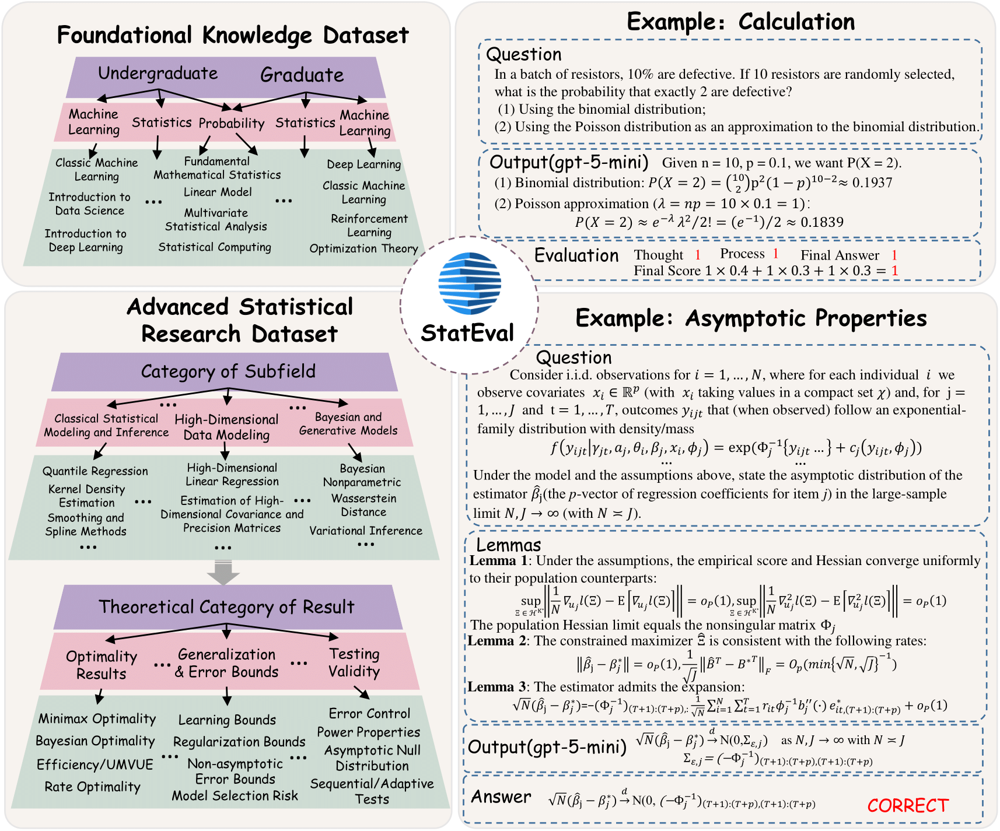
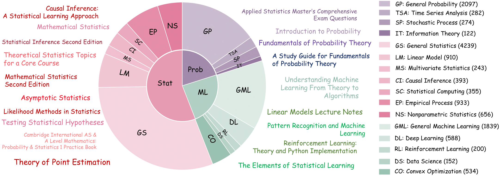
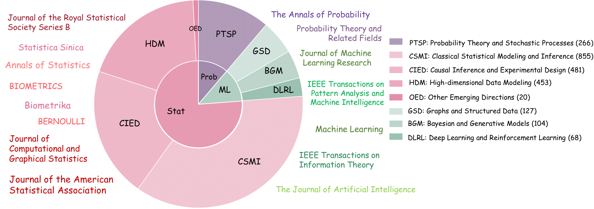
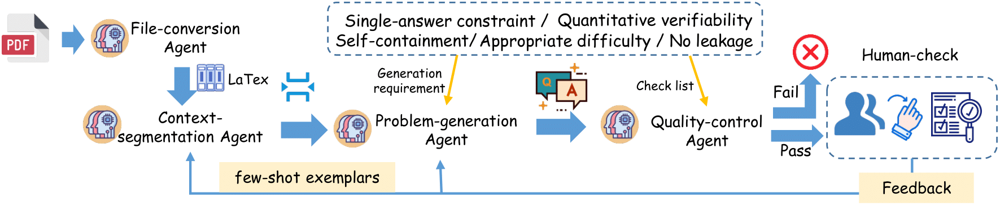
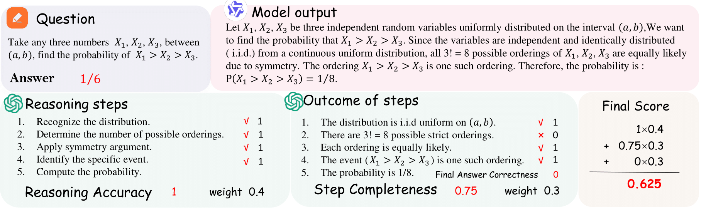

# StatEval: A Comprehensive Benchmark for Large Language Models in Statistics

StatEval is the first comprehensive benchmark dedicated to statistics, designed to evaluate large language models' statistical reasoning capabilities across various domains and difficulty levels. As AI systems increasingly participate in data-driven decision-making processes across science, industry, and policy, their ability to understand and apply statistical concepts accurately has become critically important.

## Status Update
- **Code**: Coming soon
- **Paper**: [https://arxiv.org/abs/2510.09517]
- **Website**: [https://stateval.github.io/]
- **Datasets**: Open-sourced and available at:
  - Foundational Knowledge Dataset: [https://huggingface.co/datasets/0v01111/StatEval-Foundational-knowledge](https://huggingface.co/datasets/0v01111/StatEval-Foundational-knowledge)
  - Statistical Research Dataset: [https://huggingface.co/datasets/0v01111/StatEval-Statistical-Research](https://huggingface.co/datasets/0v01111/StatEval-Statistical-Research)

## Evaluation Results

### Foundational Knowledge Dataset Results
Table 1: Foundational knowledge dataset results by academic level and domain

| Model               | Graduate                  |                |        |       | Undergraduate             |                |        |       | Overall |
|---------------------|---------------------------|----------------|--------|-------|---------------------------|----------------|--------|-------|---------|
|                     | Prob.  | Stat.  | ML    | Mean  | Prob.  | Stat.  | ML    | Mean  | Mean   |
| **Open-source Models** |                           |                |        |       |                           |                |        |       |         |
| DeepSeek-V3.1       | 51.09  | 43.27  | 44.49 | 45.13 | 80.27  | 64.57  | 47.78 | 62.88 | 53.98  |
| Qwen2.5-72B         | 68.86  | 64.58  | 62.51 | 64.62 | 78.49  | 75.98  | 72.57 | 75.68 | 70.42  |
| Qwen3-30B           | 71.46  | 71.07  | 61.49 | 67.46 | 73.76  | 74.27  | 77.37 | 75.09 | 71.49  |
| Qwen3-235B          | 73.43  | 76.92  | 68.46 | 73.13 | 84.29  | 77.55  | 80.56 | 80.57 | 76.96  |
| LLaMA-3.1-8B        | 47.98  | 40.71  | 34.74 | 39.98 | 48.94  | 44.18  | 43.12 | 45.30 | 42.79  |
| GPT-OSS-120B        | 74.42  | 75.43  | 73.31 | 74.46 | 88.76  | 84.91  | 83.32 | 85.57 | 80.27  |
| GPT-OSS-20B         | 68.19  | 72.19  | 67.48 | 69.69 | 85.53  | 81.76  | 77.10 | 81.40 | 75.77  |
| **Closed-source Models** |                          |                |        |       |                           |                |        |       |         |
| GPT-5               | 78.94  | 82.31  | 71.28 | 78.72 | 88.23  | 87.46  | 85.90 | 87.24 | 82.85  |
| GPT-5 mini          | 78.66  | 78.14  | 71.61 | 76.50 | 86.84  | 81.63  | 86.17 | 84.69 | 80.37  |
| Gemini-2.5 Pro      | 72.15  | 79.12  | 68.78 | 75.43 | 88.53  | 86.84  | 85.24 | 86.90 | 80.88  |
| Gemini-2.5 Flash    | 71.27  | 75.25  | 69.27 | 73.11 | 86.73  | 80.23  | 78.53 | 81.67 | 77.23  |

### Statistical Research Dataset Results
Table 2: Statistical research dataset results by domain and property type

| Model               | Subfields       |        |        | Result Categories               |                |                |                |                |                |                |                | Overall |
|---------------------|-----------------|--------|--------|---------------------------------|----------------|----------------|----------------|----------------|----------------|----------------|----------------|---------|
|                     | ML      | Prob.  | Stat.  | Asymp   | Conv    | Dist    | Gen     | Ident   | Opt     | Struct  | Test    | Mean    |
| **Closed-source models (CS)** |                 |        |        |                                 |                |                |                |                |                |                |                |         |
| Gem2.5-flash        | 44.10   | 58.65  | 53.26  | 53.38   | 49.24   | 56.04   | 21.23   | 67.35   | 53.45   | 60.47   | 49.30   | 51.14   |
| Gem2.5-flashlite    | 36.03   | 51.50  | 43.11  | 40.82   | 40.15   | 46.31   | 17.12   | 56.36   | 43.53   | 50.00   | 46.51   | 41.58   |
| GPT5-mini           | 48.56   | 66.54  | 59.46  | 62.20   | 54.55   | 63.42   | 25.00   | 71.48   | 52.16   | 62.79   | 63.26   | 57.62   |
| GPT5-nano           | 42.66   | 53.76  | 47.61  | 48.91   | 46.21   | 48.99   | 20.89   | 61.51   | 42.24   | 54.65   | 55.81   | 47.05   |
| **Open-source models (OS)** |                  |        |        |                                 |                |                |                |                |                |                |                |         |
| GPT-oss-120B        | 41.28   | 56.39  | 47.18  | 53.38   | 42.42   | 50.67   | 18.49   | 60.82   | 45.69   | 65.12   | 61.86   | 49.49   |
| GPT-oss-20B         | 34.26   | 48.87  | 34.26  | 44.44   | 37.12   | 43.29   | 18.15   | 55.33   | 39.66   | 52.33   | 48.84   | 42.21   |
| Qwen3-235B          | 43.29   | 62.03  | 52.08  | 53.86   | 50.76   | 59.06   | 20.55   | 67.70   | 48.28   | 55.81   | 49.77   | 51.10   |
| Qwen3-30B           | 41.20   | 59.77  | 44.93  | 49.28   | 49.24   | 53.36   | 18.15   | 61.17   | 41.38   | 60.47   | 53.49   | 47.43   |

**Note:**  
ML = Machine Learning; Prob = Probability; Stat = Statistics;  
Asymp = Asymptotic Properties; Conv = Convergence & Stability;  
Dist = Distributional Properties; Gen = Generalization & Error Bounds;  
Ident = Identifiability & Consistency; Opt = Optimality Results;  
Struct = Structural Guarantees; Test = Testing Validity.

## Overview
StatEval provides a rigorous framework for assessing large language models' proficiency in statistics, addressing a critical gap in existing AI evaluation benchmarks. As statistical reasoning forms the backbone of data-driven decision making, scientific inquiry, and empirical research, evaluating LLMs' capabilities in this domain is essential for understanding their reliability and limitations in real-world applications.

### Dataset Details

#### Foundational Knowledge Dataset
This dataset focuses on core statistical concepts and problem-solving abilities across three key domains: Probability, Statistics, and Machine Learning. It is structured to evaluate models at two academic levels:

- **Undergraduate level**: Covers fundamental concepts typically taught in introductory and intermediate statistics courses, including basic probability, descriptive statistics, hypothesis testing, and elementary machine learning algorithms.
- **Graduate level**: Includes advanced topics such as measure-theoretic probability, statistical inference, asymptotic theory, and advanced machine learning techniques commonly encountered in graduate-level coursework.

The dataset comprises a diverse range of question types, from concept recall and multiple-choice questions to open-ended problem-solving scenarios, ensuring comprehensive assessment of both knowledge retention and application abilities.

#### Statistical Research Dataset
This dataset is designed to evaluate models' ability to engage with advanced statistical research content, mirroring the challenges faced when interpreting technical literature. It includes eight distinct categories of statistical properties and results:

- Asymptotic Properties
- Convergence & Stability
- Distributional Properties
- Generalization & Error Bounds
- Identifiability & Consistency
- Optimality Results
- Structural Guarantees
- Testing Validity

These categories reflect the key types of statistical claims and guarantees commonly found in academic research papers across statistics, machine learning, and probability theory.

### Data Processing Pipeline

The **StatEval** pipeline extracts and standardizes problems from diverse academic sources using LLMs (GPT-5, Gemini series) combined with human-in-the-loop verification.  
It consists of five core stages that convert raw documents into high-quality, structured evaluation data.

**Pipeline Steps:**

1. **File Conversion**  
   Converts PDFs, scanned files, and `LaTeX` sources into structured text using multi-modal LLMs like *MinerU*.

2. **Context Segmentation**  
   Extracts theorems and relevant context using LLM-driven patterns (Gemini series), ensuring each fragment is self-contained.

3. **Problem Generation**  
   Transforms theorems and context into QA pairs using GPT-5, following rules for difficulty, self-containment, single-answer constraints, and quantitative verifiability.

4. **Quality Control**  
   Automated validation with GPT-5 checks rubric compliance and consistency before human review.

5. **Human Check & Feedback**  
   Experts verify semantic correctness, difficulty, and dataset classification. Feedback is used to improve agents iteratively.

This pipeline enables fully automated conversion of scholarly materials into standardized, high-quality evaluation datasets for statistical reasoning tasks.

  
*Illustration of the **StatEval** data processing pipeline.*

### Evaluation Methodology

Open-ended questions, including those from both the **Foundational Knowledge** and **Statistical Research** datasets, are evaluated through a process-based scoring pipeline designed to assess both final correctness and the quality of intermediate reasoning.

### 2. Evaluation Methodology

Open-ended questions, including those from both the **Foundational Knowledge** and **Statistical Research** datasets, are evaluated through a process-based scoring pipeline designed to assess both final correctness and the quality of intermediate reasoning.

**Evaluation Steps:**

1. **Reasoning Step Extraction**  
   The model’s response is parsed to identify key reasoning steps, including assumptions, logical transitions, and intermediate derivations.  
   This reconstructs the complete reasoning chain to capture how the final result is obtained.

2. **Outcome Extraction**  
   Each reasoning step is further analyzed to extract quantitative or symbolic outcomes (e.g., computed values, derived expressions, identified distributions), ensuring that both logic and intermediate results are available for verification.

3. **LLM Judging**  
   A dedicated LLM evaluator compares the extracted reasoning steps and outcomes with the reference solution, verifying correctness, necessity, and logical consistency of each step.

4. **Scoring**  
   Each step is assigned binary scores along three dimensions: Reasoning Accuracy, Step Completeness, and Final Answer Correctness.  

   Aggregated scores for one evaluation pass are calculated as a weighted sum of the three dimensions, with weights α = 0.4 for reasoning accuracy, β = 0.3 for step completeness, and the remainder for final answer correctness.  
   Scoring is repeated three times, and the final score is taken as the minimum of the three passes.

This four-step design separates reasoning reconstruction from correctness judgment, enabling fine-grained and interpretable evaluation.  
The framework outputs two complementary indicators: (1) a *final score* reflecting overall correctness, and (2) a *process score* reflecting reasoning quality and stepwise consistency.

  
*Illustration of the evaluation pipeline for open-ended questions in StatEval.*

